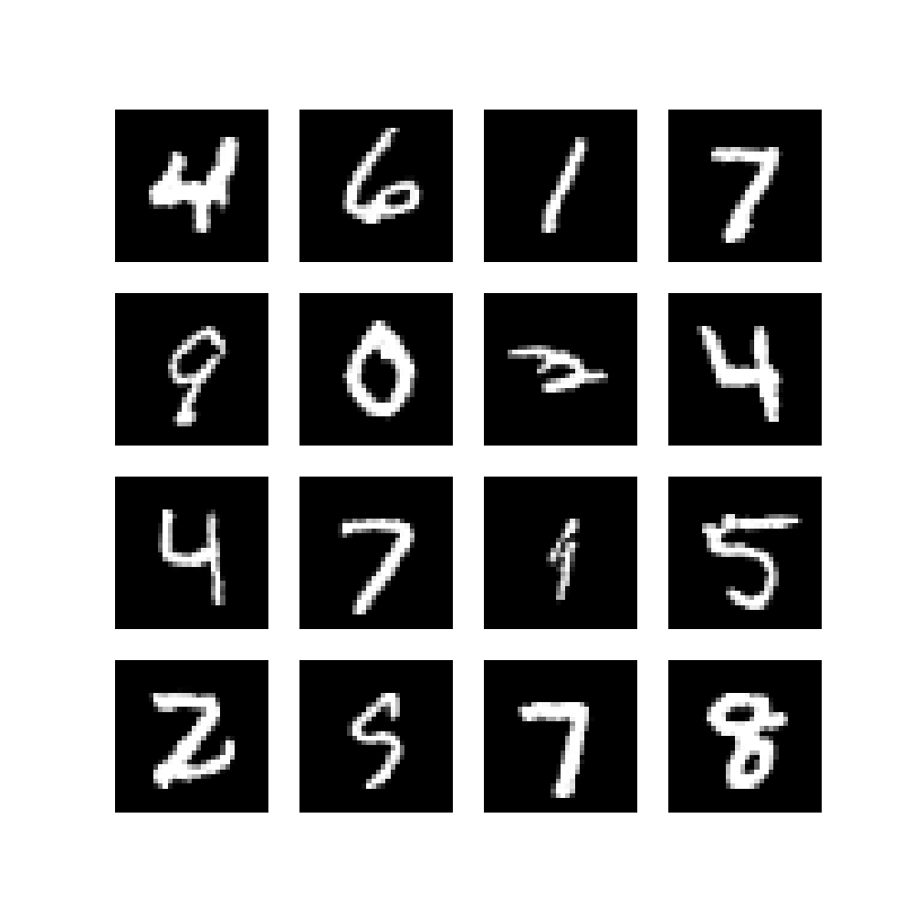
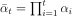
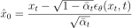
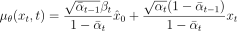

# Diffusion 图像生成项目

## 项目概述
本项目实现了一个基于扩散模型（Diffusion Model）的图像生成系统。通过逐步去噪的过程，模型能够生成高质量的图像。

## 安装说明

### 环境要求
- Python 3.7+
- PyTorch 1.7+
- CUDA（推荐用于GPU加速）

### 安装步骤
1. 克隆项目代码
```bash
git clone https://github.com/66ling66/DDPM.git
cd diffusion_re
```

2. 安装依赖
```bash
pip install -r requirements.txt
```

## 使用方法

### 训练模型
```bash
python train.py
```

### 生成图像
```bash
python inference.py
```

## 实验结果

### 生成样本
下面展示了模型在训练过程中生成的手写数字样本：



从生成结果可以看出，模型成功学习到了MNIST数据集中手写数字的特征，能够生成清晰、多样的数字图像。

## 模型架构

### 整体架构
项目使用了U-Net架构作为骨干网络，包含以下主要组件：
- 编码器（Encoder）
- 解码器（Decoder）
- 时间编码模块
- 残差连接

### DDPM调度器
调度器（Scheduler）是扩散模型中的核心组件，负责控制噪声的添加和去除过程。

#### 前向扩散过程
前向扩散过程是一个逐步添加噪声的马尔可夫链过程，其数学表达式为：

$$q(x_t|x_{t-1}) = N(x_t; \sqrt{1-\beta_t}x_{t-1}, \beta_tI)$$

其中：
- $\beta_t$ 是噪声调度参数，从$\beta_{start}$线性增加到$\beta_{end}$
- $x_t$ 是t时刻的噪声图像
- $x_{t-1}$ 是t-1时刻的图像

通过重参数化技巧，可以直接从$x_0$采样到任意时刻t：

$$x_t = \sqrt{\bar{\alpha}_t}x_0 + \sqrt{1-\bar{\alpha}_t}\varepsilon$$

这里默认 $$ beta_{start}=1e-4, beta_{end}=0.02 $$ 思考一下为什么默认值是这个

其中：
- $\alpha_t = 1 - \beta_t$
- 
- $\varepsilon \sim N(0, I)$

#### 反向扩散过程
反向扩散过程是一个逐步去噪的过程，其条件概率为：

$$p_\theta(x_{t-1}|x_t) = N(x_{t-1}; \mu_\theta(x_t, t), \sigma_t^2I)$$

其中：
- $\mu_\theta$是神经网络预测的均值
- $\sigma_t^2$是方差，可以是固定值或学习得到

预测$x_{t-1}$的计算过程：

1. 预测$x_0$：


2. 计算后验均值：


3. 采样更新：
$$x_{t-1} = \mu_\theta(x_t,t) + \sigma_t z, \quad z \sim \mathcal{N}(0,I)$$

其中$\sigma_t$是后验方差的平方根，其计算过程如下：

首先，根据贝叶斯定理，后验分布$q(x_{t-1}|x_t,x_0)$是一个高斯分布，其方差$\sigma_t^2$可以通过以下推导得到：

$$\sigma_t^2 = \frac{1}{\frac{1}{\beta_t} + \frac{\alpha_{t-1}}{1-\bar{\alpha}_t}}$$

化简后可得：

$$\sigma_t^2 = \beta_t \cdot \frac{1-\bar{\alpha}_{t-1}}{1-\bar{\alpha}_t}$$

因此：

$$\sigma_t = \sqrt{\beta_t \cdot \frac{1-\bar{\alpha}_{t-1}}{1-\bar{\alpha}_t}}$$

这个推导说明了后验方差$\sigma_t^2$是如何依赖于噪声调度参数$\beta_t$和累积$\alpha$值的。在实际实现中，我们直接使用这个公式来计算采样时需要的噪声系数。
#### 实现细节
调度器实现了以下关键功能：

1. 噪声调度初始化：
- 线性$\beta$调度：$\beta_t$从$\beta_{start}$到$\beta_{end}$
- 计算$\alpha$系数：$\alpha_t = 1 - \beta_t$
- 计算累积$\alpha$：$\bar{\alpha}_t = \prod\alpha_i$

2. 前向过程（add_noise）：
- 根据时间步$t$获取对应的$\bar{\alpha}_t$
- 计算噪声系数$\sqrt{1-\bar{\alpha}_t}$
- 合成带噪声的图像$x_t$

3. 反向过程（step）：
- 预测原始图像$x_0$
- 计算去噪均值$\mu_t$
- 添加适量随机噪声

### 时间步长编码
模型使用正弦位置编码来处理时间信息：

- 输入：时间步长张量
- 输出：时间步长的正弦位置嵌入
- 实现：使用正弦和余弦函数生成不同频率的波形
- 维度：可配置的嵌入维度

#### 数学原理
时间步长编码采用正弦位置编码（Sinusoidal Position Embeddings）的方法，其数学表达式为：

$$PE(t, 2i) = sin(t / 10000^{2i/d})$$

$$PE(t, 2i+1) = cos(t / 10000^{2i/d})$$

其中：
- $t$ 是时间步长
- $i$ 是维度的索引
- $d$ 是嵌入维度
- $PE(t,k)$ 表示时间t在第k维的编码值

#### 实现细节
时间编码的计算过程：
1. 将输入维度d分为两半，分别用于sin和cos计算
2. 计算基础频率：$$\omega = ln(10000)/(d/2-1)$$
3. 生成不同频率的波形：$$f(i) = exp(-\omega \cdot i)$$，$i\in[0, d/2)$
4. 将时间信息t与频率信息结合：$$t \cdot f(i)$$
5. 分别计算$$sin(t \cdot f(i))$$和$$cos(t \cdot f(i))$$
6. 连接sin和cos得到最终的d维位置嵌入

#### 优势
1. 唯一性：不同时间步长会得到唯一的编码
2. 平滑性：相近的时间步长会得到相似的编码
3. 有界性：所有编码值都在[-1, 1]范围内
4. 可扩展性：支持任意长度的时间序列


## 参考文献

1. Ho, J., Jain, A., & Abbeel, P. (2020). Denoising diffusion probabilistic models. Advances in Neural Information Processing Systems, 33, 6840-6851.


## TODO List

### 修改公式

由于有些公式是用latex语法书写，可能无法渲染，之后插入svg图片来替代部分符号和公式

### DDIM采样方法实现计划

1. DDIM数学原理补充
   - DDIM条件概率推导
   - 确定性采样过程说明
   - 与DDPM概率流的对比分析

2. 代码实现规划
   - 在scheduler.py中添加DDIMScheduler类
   - 实现DDIM采样算法
   - 添加采样步数控制接口
   - 实现确定性/随机采样切换功能

3. 性能对比分析
   - 采样速度对比（DDIM vs DDPM）
   - 生成质量评估
   - 不同采样步数下的效果分析